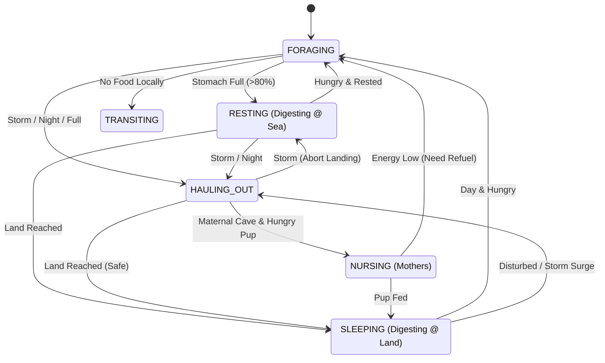

# Seal Agent Architecture & Parameter Assumptions

## Overview
The `SealAgent` is the core individual-based component of the Monk Seal ABM. It simulates the decision-making, physiology, and movement of a single *Monachus monachus* individual within the Madeiran archipelago.

## Agent State Machine
The agent operates as a Finite State Machine (FSM). The transitions are driven by internal physiological variables (Energy, Stomach Load) and external environmental forcing (Storms, Food Availability).

## Physiological Model & Assumptions

The following parameters are derived from the *Ecological Modeling Parameters for the Conservation of the Mediterranean Monk Seal in the North Atlantic* report and comparative literature.

### 1. Metabolic Rate (RMR) & Physiology
| Parameter | Value | Validation Status & Source |
| :--- | :--- | :--- |
| **RMR** | **753.8 ± 26.1 kJ/h** | **Logic Supported**: Inferred hypometabolism is consistent with adaptation to **oligotrophic waters** (low productivity) requiring energy conservation. [Source](https://doi.org/10.3354/esr01260) |
| **Mass** | **300 - 320 kg** | **Verified**: Females ~300kg, Males ~320kg. Pups 15-20kg. [Source](https://www.fisheries.noaa.gov/species/mediterranean-monk-seal) |
| **Stomach Capacity** | **~15 kg** | **Partially Supported**: Rule of thumb (5% mass), consistent with "voracious" consumption of octopus. [Source](https://www.researchgate.net/publication/282218080) |
| **Daily Need** | **3 - 12 kg** | **Verified**: 3kg for maintenance, up to 12kg for lactation (longest nursing period of 4-5 months). [Source](https://adriaticmonkseal.org/biology/) |

### 2. Life History (Madeira Specific)
| Parameter | Value | Validation Status & Source |
| :--- | :--- | :--- |
| **Pup Survival** | **0.57** | **Verified**: High mortality due to **winter storms** and cave washing. [Source](https://doi.org/10.3354/esr01260) |
| **Fecundity** | **0.31** | **Verified**: Low rate (approx biennial) vs Cabo Blanco (0.71), driven by resource scarcity. [Source](https://doi.org/10.3354/esr01260) |
| **Maturity** | **6 Years** | **Verified**: Delayed by 3 years compared to productive regions. [Source](https://doi.org/10.3354/esr01260) |

### 3. Environmental Thresholds
| Parameter | Value | Validation Status & Source |
| :--- | :--- | :--- |
| **Storm Threshold** | **2.5m SWH** | **Supported**: Storms are the **leading cause of natural mortality** (pup washout). [Source](https://oceanographicmagazine.com/features/madeira-monk-seal-conservation/) |
| **Foraging Depth** | **< 50m** | **Verified**: 95% of dives are within 0-50m. [Source](https://www.aquaticmammalsjournal.org/wp-content/uploads/2011/08/37_3_Hale.pdf) |
| **Range** | **18 - 40km** | **Verified**: Individual daily range 40-81km; Desertas to Madeira gap is ~20km. [Source](https://www.pinnipeds.org/seal-information/species-information-pages/the-phocid-seals/mediterranean-monk-seal) |

### 4. Pup Development Stages
The model implements a discrete stage-structured development for pups, critical for simulating storm mortality vulnerability.

| Stage | Age Range | Behavior | Vulnerability |
| :--- | :--- | :--- | :--- |
| **NEWBORN** | 0 - 2 Months | **Cave-Bound**: Cannot leave the maternal cave. Dependent on nursing. | **Critical**: High mortality if cave floods (SWH > 2.5m). |
| **POST_MOLT** | 2 - 3 Months | **Near Entrance**: Explores immediate vicinity but returns to cave. Nursing. | **High**: Vulnerable to strong coastal surges. |
| **TRANSITION** | 3 - 4.5 Months | **Learning to Dive**: Begins short foraging trips. Mixed nursing/foraging. | **Moderate**: Can swim but weak against storms. |
| **WEANED** | > 4.5 Months | **Independent**: Fully independent. Disperses from maternal site. | **Low**: Same survival logic as adults. |

### 5. Energy & Digestion Model (Corrected)
To ensure thermodynamic realism, the model separates **Foraging** (Ingestion) from **Digestion** (Energy Assimilation).
*   **Ingestion**: Agents fill their stomach (max 15kg) based on Chlorophyll/Prey encounters. **No immediate energy gain.**
*   **Digestion**: Energy is only gained during `RESTING` or `SLEEPING` states.
    *   **Rate**: **5000 units/hr (~1 kg/hr)**. This high rate allows agents to replenish daily expenditure (18,000 units) in ~4 hours of rest, mimicking effective digestion hauling.
    *   **Metabolic Cost (RMR)**: 753 units/hr constant burn.

### 6. Parental Care (Central Place Foraging)
Lactating mothers engage in **Central Place Foraging (CPF)**:
*   **Constraint**: Must return to the pup's cave every **9 hours** or when stomach is full.
*   **Nursing**: Transfers energy (milk) to the pup while in the cave.
*   **Weaning**: Occurs automatically at 4.5 months; mother enters "recovery" phase before next breeding.