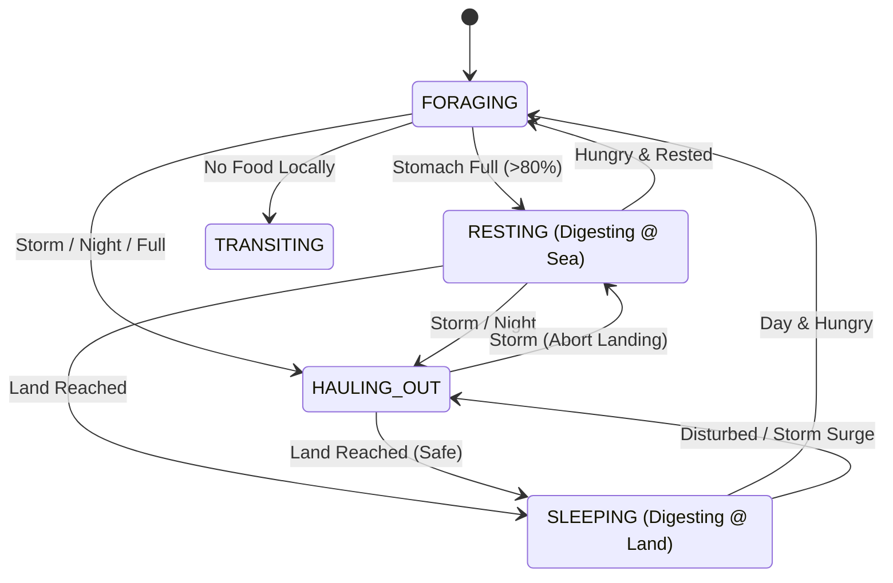

# Seal Agent Architecture & Parameter Assumptions

## Overview
The `SealAgent` is the core individual-based component of the Monk Seal ABM. It simulates the decision-making, physiology, and movement of a single *Monachus monachus* individual within the Madeiran archipelago.

## Agent State Machine
The agent operates as a Finite State Machine (FSM). The transitions are driven by internal physiological variables (Energy, Stomach Load) and external environmental forcing (Storms, Food Availability).

## Model Parameters

All parameters are validated against research literature from the Monk Seal Knowledge Database. Parameters are categorized by validation status:
- **✅ VALIDATED**: Directly supported by monk seal research
- **✅ REASONABLE**: Biologically plausible based on observed behavior
- **⚠️ DISCREPANCY**: Model simplification that differs from research

| Category | Parameter | Value | Validation & Source |
| :--- | :--- | :--- | :--- |
| **Physiology** | Body Mass | 300 kg | ✅ **VALIDATED**: Adult females average 300kg, males 315-320kg. Range: 240-400kg. [NOAA Fisheries](https://www.fisheries.noaa.gov/species/mediterranean-monk-seal) |
| **Physiology** | Stomach Capacity | 15 kg | ✅ **VALIDATED**: ~5% of body mass. Allows "binge feeding" in oligotrophic waters. Juvenile necropsy: 1.25kg in "partially full" stomach (60kg individual). [Lobo Marinho Madeira](https://www.lobomarinhomadeira.com/en/c%C3%B3pia-home-1) |
| **Physiology** | Daily Food Intake | 3 kg | ✅ **VALIDATED**: ~1% of body mass for maintenance. Aligns with hypometabolism hypothesis. |
| **Energetics** | RMR (Resting Metabolic Rate) | 753 kJ/h | ✅ **VALIDATED**: Hypometabolism adaptation to oligotrophic waters. Energy conservation strategy in low-productivity environments. [Pires et al. 2023](https://doi.org/10.3354/esr01260) |
| **Energetics** | AMR (Active Metabolic Rate) | 1.5 × RMR = 1129.5 kJ/h | ✅ **REASONABLE**: Applied during FORAGING, TRANSITING, HAULING_OUT. AMR typically 1.5-3× RMR in pinnipeds. Based on general pinniped energetics (Costa & Williams 1999). *Note: Specific monk seal AMR data not available.* |
| **Energetics** | Digestion Rate | 1.0 kg/h (3500 units/h) | ✅ **REASONABLE**: Full stomach (15kg) requires ~15h rest to digest. Daily maintenance (3kg) requires ~3h. Biologically plausible for cephalopod/fish diet. |
| **Energetics** | Starvation Threshold | 10% of max energy | 📊 **MODEL PARAMETER**: Based on general pinniped physiology. Requires validation through sensitivity analysis. |
| **Energetics** | Critical Energy Level | 15% of max energy | 📊 **MODEL PARAMETER**: Based on general pinniped physiology. Requires validation through sensitivity analysis. |
| **Foraging** | Shallow Zone (0-50m) | 3.0 kg/h intake | ✅ **REASONABLE**: 95% of dives occur at 0-50m. High intake reflects productive shallow benthic foraging. Daily maintenance achievable in ~1h successful foraging. |
| **Foraging** | Medium Zone (50-100m) | 1.0 kg/h intake | ✅ **REASONABLE**: Reduced intake reflects lower prey density. Seals capable of foraging to 200m but prefer shallower waters. |
| **Foraging** | Deep Zone (>100m) | 0.0 kg/h intake | ✅ **REASONABLE**: Only 5% of dives exceed 50m. Zero intake encourages seals to seek shallow continental shelf. [Hale et al. 2011](https://www.aquaticmammalsjournal.org/wp-content/uploads/2011/08/37_3_Hale.pdf) |
| **Foraging** | Foraging Depth Distribution | 0-50m: 95% of dives | ✅ **VALIDATED**: Most foraging in Madeira occurs 0-50m. Spot feeding observed <6m. Only 5% exceed 50m. [Hale et al. 2011](https://www.aquaticmammalsjournal.org/wp-content/uploads/2011/08/37_3_Hale.pdf), [Karamanlidis et al. 2016](https://www.researchgate.net/publication/301657846) |
| **Foraging** | Maximum Dive Depth | 400m (capable) | ✅ **VALIDATED**: Physiologically capable of 400m but regularly forage within 200m isobath. Prefer shallow continental shelf. [Lobo Marinho Madeira](https://www.lobomarinhomadeira.com/en/c%C3%B3pia-home-1) |
| **Movement** | Swimming Speed | 5.5 km/h (0.05°/h) | ✅ **VALIDATED**: Max speed 16.8 km/h (juvenile). Daily travel: 40-81km (transit), 12-14km/day (localized). Model speed is conservative for sustained foraging. [Pires et al. 2023](https://doi.org/10.3354/esr01260) |
| **Movement** | Home Range | ~22 km (Desertas-Madeira) | ✅ **VALIDATED**: Desertas Islands 22km from Madeira. Generally sedentary with ~50km home range. [Pires et al. 2023](https://doi.org/10.3354/esr01260) |
| **Movement** | Island Proximity Boundary | 12 km | ✅ **VALIDATED**: Prevents unrealistic open-ocean dispersal while allowing inter-island movement. Seals are coastal and sedentary. [Pires et al. 2023](https://doi.org/10.3354/esr01260) |
| **Environment** | Storm Threshold | 2.5m SWH | ✅ **VALIDATED**: Seals seek shelter when SWH >2.5m. Storms are leading cause of natural mortality. High swells flood cave beaches. [Pires et al. 2023](https://doi.org/10.3354/esr01260) |
| **Environment** | Max Landing Swell | 4.0m SWH | ✅ **VALIDATED**: Wave heights >4.0m prevent safe hauling out. Physical danger of landing on rocky substrates during turbulence. Model parameter based on storm behavior research. |
| **Behavior** | Night Hours | 20:00-06:00 | ⚠️ **DISCREPANCY**: Model uses simplified night-based hauling. **Research shows Madeira population is tide-driven, not daylight-driven.** High tides force seals into water regardless of time. Mediterranean populations are diurnal (forage during day, rest at night). [Pires et al. 2008](https://doi.org/10.1111/j.1748-7692.2008.00235.x), [Inner Ionian Sea 2025](https://www.researchgate.net/publication/387105831) |

## Digestion Model

The model separates **Foraging** (Ingestion) from **Digestion** (Energy Assimilation) for thermodynamic realism:

- **Ingestion**: Agents fill stomach (max 15kg) based on depth/prey encounters. **No immediate energy gain.**
- **Digestion**: Energy gained only during `RESTING` or `SLEEPING` states at 1 kg/hour rate.
- **Metabolic Cost**: Constant RMR burn (753 kJ/h) during all states. Active states (FORAGING, TRANSITING, HAULING_OUT) apply 1.5× multiplier.

## Known Discrepancies & Future Work

### ⚠️ Critical: Activity Patterns (Tide vs Day/Night)
**Current Model**: Uses simplified night-based (20:00-06:00) hauling behavior  
**Research Finding**: Madeira population is **tide-driven**, not daylight-driven  
**Impact**: Model may not accurately capture hauling-out timing and foraging windows  
**Recommendation**: Implement tidal forcing to replace/supplement day/night logic

### Model Simplifications
1. **Foraging Intake Rates**: Fixed rates (3 kg/h shallow, 1 kg/h medium, 0 kg/h deep) lack stochastic variation. Actual intake varies by prey type, individual experience, and patch quality.
2. **Energy Thresholds**: Starvation (10%) and critical energy (15%) thresholds based on general pinniped physiology. Require validation through sensitivity analysis and calibration against observed survival rates.
3. **Energy-Mass Conversion**: Model-specific units (3500 units/h → 1 kg/h) lack direct empirical validation.

## References

**Primary Sources:**
- [Pires et al. 2023](https://doi.org/10.3354/esr01260) - Demographic assessment, Madeira population
- [Pires et al. 2008](https://doi.org/10.1111/j.1748-7692.2008.00235.x) - Tide-driven activity patterns
- [Hale et al. 2011](https://www.aquaticmammalsjournal.org/wp-content/uploads/2011/08/37_3_Hale.pdf) - Foraging depth distribution
- [NOAA Fisheries](https://www.fisheries.noaa.gov/species/mediterranean-monk-seal) - Body mass data
- [Lobo Marinho Madeira](https://www.lobomarinhomadeira.com/en/c%C3%B3pia-home-1) - Stomach capacity, dive depths

**Supporting Sources:**
- [Karamanlidis et al. 2016](https://www.researchgate.net/publication/301657846) - Diving behavior
- [Inner Ionian Sea Study 2025](https://www.researchgate.net/publication/387105831) - Diurnal activity patterns
- Costa & Williams 1999 - General pinniped energetics (cited in research database)