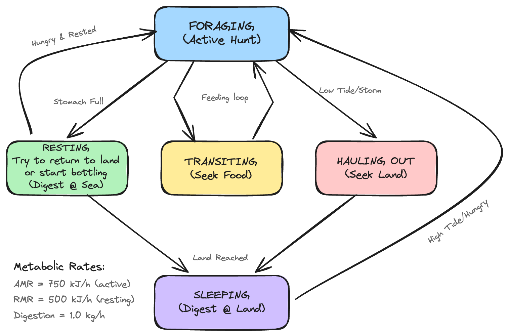

# Seal Agent Architecture & Scientific Validation

## Overview

The `SealAgent` is the core individual-based component of the Monk Seal ABM. It simulates the decision-making, physiology, and movement of a single *Monachus monachus* individual within the Madeiran archipelago.

This document focuses on the **scientific validation** of model parameters. For implementation details and tuning guidance, see the [Model Parameters & Tuning Guide](model_parameters.md).

## Agent State Machine

The agent operates as a Finite State Machine (FSM). Transitions are driven by internal physiological variables (Energy, Stomach Load) and external environmental forcing (Tides, Storms, Food Availability).



> **Source file**: [diagrams/seal_state_machine.excalidraw](diagrams/seal_state_machine.excalidraw) — open at [excalidraw.com](https://excalidraw.com) to edit

**State Summary:**

| State | Location | Metabolic Rate | Energy Flow | Trigger to Exit |
|:------|:---------|:---------------|:------------|:----------------|
| FORAGING | Sea (0-50m) | AMR (750 kJ/h) | Stomach ↑ | Full, no food, or tide/storm |
| RESTING | Sea | RMR (750 kJ/h) | Energy ↑ | Hungry, or land opportunity |
| TRANSITING | Sea | AMR (750 kJ/h) | — | Reaches food patch |
| HAULING_OUT | Sea→Land | AMR (750 kJ/h) | — | Reaches land or aborts |
| SLEEPING | Land | RMR (750 kJ/h) | Energy ↑ | High tide or hungry |

## Scientific Validation of Parameters

All parameters are validated against peer-reviewed research on Mediterranean monk seals. For tuning guidance and sensitivity analysis, see [Model Parameters & Tuning Guide](model_parameters.md).

### Validated Parameters

These values are directly supported by monk seal field studies:

| Parameter | Value | Source & Notes |
|:----------|:------|:---------------|
| Body Mass | 300 kg | Adult females average 300kg, males 315-320kg. Range: 240-400kg. [Animal Diversity Web](https://animaldiversity.org/accounts/Monachus_monachus/), [Eastern Adriatic Monk Seal Project](https://adriaticmonkseal.org/biology/) |
| Daily Food Intake | 3 kg | ~1% of body mass for maintenance. Model parameter — consistent with general pinniped physiology. |
| Shallow Foraging (0-50m) | 3.0 kg/h | 95% of dives occur at 0-50m. Base rate modulated by HSI. [Hale et al. 2011](https://www.aquaticmammalsjournal.org/wp-content/uploads/2011/08/37_3_Hale.pdf) |
| Foraging Depth Distribution | 95% at 0-50m | Spot feeding observed <6m. Only 5% exceed 50m. [Hale et al. 2011](https://www.aquaticmammalsjournal.org/wp-content/uploads/2011/08/37_3_Hale.pdf), [Kiraç et al. 2002](https://www.researchgate.net/publication/301657846) |
| Maximum Dive Depth | 200m | Capable of 200m dives but regularly forage shallower. [Eastern Adriatic Monk Seal Project](https://adriaticmonkseal.org/biology/) |
| HSI Productivity | min(chl/0.5, 1.0) | Chlorophyll modulates foraging yield. Madeira is oligotrophic (~0.1-0.3 mg/m³). |
| Swimming Speed | 5.5 km/h | Max ~17 km/h; daily travel 40-81 km on transit, 12-14 km while foraging. Derived from movement tracking — see [Adamantopoulou et al. 2011](https://www.aquaticmammalsjournal.org/wp-content/uploads/2011/08/37_3_Adamantopoulou.pdf) for range data. |
| Home Range | ~22 km | Sedentary with ~50km range. Long-range: 288km over 3 months. [Adamantopoulou et al. 2011](https://www.aquaticmammalsjournal.org/wp-content/uploads/2011/08/37_3_Adamantopoulou.pdf) |
| Island Proximity | 12 km | Coastal and sedentary behavior. [Karamanlidis et al. 2004](https://www.cambridge.org/core/journals/oryx/article/availability-of-resting-and-pupping-habitat-for-the-critically-endangered-mediterranean-monk-seal-monachus-monachus-in-the-archipelago-of-madeira/26FDF046B0B81D1A3DC707E722174931) |
| Storm Threshold | 2.5m SWH | Seals seek shelter above this. Storm effects on monk seal behavior confirmed in [Gazo et al. 2000](https://www.researchgate.net/publication/227717823); specific SWH value is a model parameter requiring field calibration. [Karamanlidis et al. 2004](https://www.cambridge.org/core/journals/oryx/article/availability-of-resting-and-pupping-habitat-for-the-critically-endangered-mediterranean-monk-seal-monachus-monachus-in-the-archipelago-of-madeira/26FDF046B0B81D1A3DC707E722174931) documents cave flooding from swells. |
| Max Landing Swell | 4.0m SWH | Physical danger of landing on rocky substrates. Model parameter requiring field calibration. [Karamanlidis et al. 2004](https://www.cambridge.org/core/journals/oryx/article/availability-of-resting-and-pupping-habitat-for-the-critically-endangered-mediterranean-monk-seal-monachus-monachus-in-the-archipelago-of-madeira/26FDF046B0B81D1A3DC707E722174931) |
| Tidal Period | 12.4 hours | Atlantic semidiurnal tides. Sighting rates 1.5× higher at high tide. [Pires et al. 2007](https://www.researchgate.net/publication/254846183) |
| High Tide Threshold | 0.70 | Caves flood, forcing seals into water. [Pires et al. 2007](https://www.researchgate.net/publication/254846183) |
| Low Tide Threshold | 0.30 | Cave beaches accessible for haul-out. [Pires et al. 2007](https://www.researchgate.net/publication/254846183) |

> **Note**: Madeira seals are tide-driven, not circadian. Day/night detection exists in code but tidal forcing takes priority. [Pires et al. 2007](https://www.researchgate.net/publication/254846183)

### Biologically Reasonable Parameters

These values lack direct monk seal measurements but are consistent with observed behavior and pinniped physiology:

| Parameter | Value | Rationale |
|:----------|:------|:----------|
| Stomach Capacity | 15 kg | ~5% of body mass. Allows binge feeding of multiple octopus (1.25-2.4 kg each). General pinniped physiology; requires direct measurement for *M. monachus*. |
| AMR Multiplier | 1.5× RMR | Applied during active states. AMR typically 1.5-3× RMR in pinnipeds. Costa & Williams (1999), "Marine mammal energetics." In: Reynolds & Rommel (eds.), *Biology of Marine Mammals*, Smithsonian Institution Press, pp. 176-217. |
| Digestion Rate | 1.0 kg/h | Full stomach (15kg) requires ~15h rest. Biologically plausible for cephalopod/fish diet. |
| Medium Foraging (50-100m) | 1.0 kg/h | Reduced intake reflects lower prey density at depth. |
| Deep Foraging (>100m) | 0.0 kg/h | Cannot reach benthos. Encourages seals to seek continental shelf. |

### Model-Specific Parameters

Parameters derived from allometric equations or requiring sensitivity analysis are documented in [Model Parameters & Tuning Guide](model_parameters.md):

- **RMR** (500 kJ/h) — Derived from Kleiber equation with hypometabolism correction
- **Starvation Threshold** (10%) — Based on general pinniped physiology
- **Critical Energy Level** (15%) — Triggers desperate foraging behavior
- **Energy-per-kg conversion** (3500 kJ/kg) — Model-specific unit mapping

## Digestion Model

The model separates **Foraging** (Ingestion) from **Digestion** (Energy Assimilation) for thermodynamic realism:

- **Ingestion**: Agents fill stomach (max 15kg) based on depth/prey encounters. **No immediate energy gain.**
- **Digestion**: Energy gained only during `RESTING` or `SLEEPING` states at 1 kg/hour rate.
- **Metabolic Cost**: Constant RMR burn (750 kJ/h) during all states. Active states (FORAGING, TRANSITING, HAULING_OUT) apply 1.5× multiplier.

## RMR Derivation Note

The RMR value of **750 kJ/h** is derived from the Kleiber allometric equation scaled for phocid seals:

```
RMR = 293 × M^0.75  (terrestrial baseline)
    = 293 × 300^0.75
    = 293 × 72.08
    ≈ 21,119 kJ/day ≈ 880 kJ/h (baseline)
```

Phocid seals at rest measure ~1.0–1.3× Kleiber (Lavigne et al. 1986; Bowen & Lavigne 1987). The model uses **750 kJ/h** (~0.85× baseline), reflecting:
1. **Subtropical reduction**: Reduced thermoregulatory demand in warm Madeiran waters
2. **Phocid physiology**: Within the measured range for resting pinnipeds (~600–1,100 kJ/h for 300kg)
3. **Sensitivity requirement**: Should be tested through calibration against observed survival rates

## Model Simplifications

1. **Foraging Intake Rates**: Fixed rates (3 kg/h shallow, 1 kg/h medium, 0 kg/h deep) lack stochastic variation. Actual intake varies by prey type, individual experience, and patch quality.
2. **Energy Thresholds**: Starvation (10%) and critical energy (15%) thresholds based on general pinniped physiology. Require validation through sensitivity analysis and calibration against observed survival rates.
3. **Energy-Mass Conversion**: Model-specific units (3500 units/h → 1 kg/h) lack direct empirical validation.

## References

**Primary Sources (with direct URLs):**
- [Pires et al. 2007](https://www.researchgate.net/publication/254846183) — Activity patterns of the Mediterranean monk seal (*Monachus monachus*) in the Archipelago of Madeira. *Aquatic Mammals* 33(3), 374-384.
- [Pires et al. 2008](https://www.cambridge.org/core/journals/oryx/article/critically-endangered-mediterranean-monk-seal-monachus-monachus-in-the-archipelago-of-madeira-priorities-for-conservation/307F69CCDC071125B306BBE9C7AC69D3) — The critically endangered Mediterranean monk seal in the Archipelago of Madeira: priorities for conservation. *Oryx* 42(2).
- [Hale et al. 2011](https://www.aquaticmammalsjournal.org/wp-content/uploads/2011/08/37_3_Hale.pdf) — Mediterranean monk seal (*Monachus monachus*) fishery interactions in the Archipelago of Madeira. *Aquatic Mammals* 37(3), 298-304.
- [Gazo et al. 2000](https://www.researchgate.net/publication/227717823) — Pup survival in the Mediterranean monk seal (*Monachus monachus*) colony at Cabo Blanco Peninsula (Western Sahara-Mauritania). *Marine Mammal Science* 16(3), 523-535. *(Documents storm effects on pup survival and behaviour; specific SWH thresholds are model parameters.)*
- [Karamanlidis et al. 2004](https://www.cambridge.org/core/journals/oryx/article/availability-of-resting-and-pupping-habitat-for-the-critically-endangered-mediterranean-monk-seal-monachus-monachus-in-the-archipelago-of-madeira/26FDF046B0B81D1A3DC707E722174931) — Availability of resting and pupping habitat for the critically endangered Mediterranean monk seal in the Archipelago of Madeira. *Oryx* 38(2), 180-185.

**Supporting Sources:**
- [Kiraç et al. 2002](https://www.researchgate.net/publication/301657846) — Observations on diving behaviour of free ranging Mediterranean monk seals (*Monachus monachus*) on Turkish coasts. *The Monachus Guardian* 5(1), 37-42.
- [Adamantopoulou et al. 2011](https://www.aquaticmammalsjournal.org/wp-content/uploads/2011/08/37_3_Adamantopoulou.pdf) — Movements of Mediterranean monk seals (*Monachus monachus*) in the Eastern Mediterranean Sea. *Aquatic Mammals* 37(3), 256-261. DOI: 10.1578/AM.37.3.2011.256
- [Alfaghi et al. 2013](https://doi.org/10.1578/AM.39.1.2013.81) — First confirmed sighting of the Mediterranean monk seal (*Monachus monachus*) in Libya since 1972. *Aquatic Mammals* 39(1), 81-84.
- [Animal Diversity Web — Monachus monachus](https://animaldiversity.org/accounts/Monachus_monachus/) — Species profile with body mass data.
- [Eastern Adriatic Monk Seal Project](https://adriaticmonkseal.org/biology/) — Biology overview, dive depths.
- Costa, D.P. & Williams, T.M. (1999). Marine mammal energetics. In: Reynolds, J.E. & Rommel, S.A. (eds.), *Biology of Marine Mammals*, Smithsonian Institution Press, pp. 176-217.